# JAVA程序设计—五子棋游戏

[一](#_Toc107078602).功能设计 2

[1.1五子棋算法 2](#_Toc107078603)

[1.2联机操作 2](#_Toc107078604)

[1.3存盘与读取 2](#_Toc107078605)

[1.4回放棋局 2](#_Toc107078606)

[1.5图窗界面设置 2](#_Toc107078607)

[二](#_Toc107078608).核心类 3

[2.1UML图 3](#_Toc107078609)

[2.2核心类简述 3](#_Toc107078610)

[2.2.1Gobang包 3](#_Toc107078611)

[2.2.2Component包 6](#_Toc107078612)

[2.2.3MainContact包 6](#_Toc107078613)

[2.2.4PlayBack包 6](#_Toc107078614)

[2.2.5Util包 6](#_Toc107078615)

[2.3编程方式 6](#_Toc107078616)

[三](#_Toc107078617).测试结果 7

[3.1五子棋算法 7](#_Toc107078618)

[3.2联机操作 7](#_Toc107078619)

[3.2.1联机对战 7](#_Toc107078620)

[3.2.2发送信息 8](#_Toc107078621)

[3.3存盘与读取 8](#_Toc107078622)

[3.3.1比赛结束存盘 8](#_Toc107078623)

[3.3.2中途存盘 9](#_Toc107078624)

[3.3.3恢复中途比赛 9](#_Toc107078625)

[3.4回放棋局 10](#_Toc107078626)

[3.5图窗界面设置 11](#_Toc107078627)

[3.5.1主界面 11](#_Toc107078628)

[3.5.2服务器界面 11](#_Toc107078629)

[3.5.3客户端界面 11](#_Toc107078630)

[3.5.4回放界面 12](#_Toc107078631)

[四](#_Toc107078632).调试过程 13

[4.1五子棋算法调试 13](#_Toc107078633)

[4.2网络连接调试 13](#_Toc107078634)

[4.3多线程运行调试 13](#_Toc107078635)

[4.4文件存储与读取调试 13](#_Toc107078636)

[4.5界面布局调试 13](#_Toc107078637)

# 一.功能设计

## 1.1五子棋算法

无禁手规则:(本游戏中心的就是这种规则)

黑白双方依次落子，由黑先下，当棋盘上有三个子时(两黑一白),如果此时白方觉得开的局不利于自已可以提出交换,黑方无条件接受!也可以不交换,主动权在白方!然后继续下棋,任一方先在棋盘上形成横向、竖向、斜向的连续的相同颜色的五个(含五个以上)棋子的一方为胜。

## 1.2联机操作

服务端先开启服务器，然后客户端通过输入对应的ip地址，连接到服务器，就可以开始游戏和聊天。

## 1.3存盘与读取

存盘1：游戏结束[包括一方投降、或者出现五子连珠情况]时进行存盘，此时存储的文件名为res.txt，且存盘是双方都要进行的操作。

存盘2：由于服务端或者客户端一方申请暂停比赛，两方同时点击保存游戏，进行存盘，此时存储的文件名为dr.txt。

读取1：详细见回放棋局。

读取2：在游戏开始时，读取dr.txt文件[上一局的残局]，然后继续比赛。

## 1.4回放棋局

读取res.txt，在回放界面进行回放，回放时可以点击上一步和下一步进行操作。

## 1.5图窗界面设置

界面1：主界面。主界面主要包括服务端进入按钮，客户端进入按钮，回放比赛按钮，退出游戏四个按钮。然后对背景进行简单优化，添加背景图和游戏名称[墨攻棋阵]。

界面2：服务端界面。该界面主要包括开启服务器、等待连接、退出等功能的下拉菜单，聊天框和文字输入框，游戏界面以及各种控制游戏的按钮。

界面3：客户端界面。该界面类似服务端界面，区别在于减少服务端的开启服务器等功能按键，增加连接服务器的按键。

界面4：回放界面。该界面主要包括棋盘图片，和一些控制回放的按键[上一步、下一步等]，此外对游戏背景进行优化，添加背景图片。

注：上述所有按键均应该实现异常点击或者成功操作等提示。

# 二.核心类

## 2.1UML图

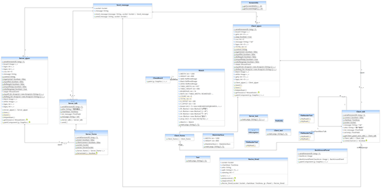

## 2.2核心类简述

### 2.2.1Gobang包

**Client** 的相关类

**Client\_frame** 类：此类继承自Jframe,用于搭建Client端结构和进行界面设置，采用BoarderLayout布局方式。对屏幕大小，对话框以及棋盘等组件进行布局和设置。

**Client\_qipan** 类：Client棋盘中各种事件的操作类以及与其他类想联系的"接口"。在构造方法中实现6个核心Button的功能，开始/暂停、认输、后退、重新开始、返回主界面和保存。判断输赢的五子棋核心算法也在此类中。此外，此类中声明了很多public static类型的变量，主要用于后期网络交流状态的变化和多线程的操作。

    // 输赢判断的方法
    
    publicvoid baipanduan() {
    
        // if (h\_list.size() \> 5) {// 黑棋至少点了五次之后才执行
    
        // f判断是白棋还是黑棋,true表示黑棋,false表示白棋
    
        for (int i = 0; i \< myself\_list.size(); i++) {
    
            cou = 0; // 在判断每一个棋子的时候，都要给cou赋值为0
    
            String s = myself\_list.get(i); // 获得集合里面的单个字符串
    
            String[] a = s.split(",");
    
            hgex = Integer.parseInt(a[0]);
    
            int tempx = hgex;
    
            hgey = Integer.parseInt(a[1]);
    
            int tempy = hgey;
    
            // 横向判断
    
            // 黑棋的某个点x坐标+1，Y不变，表示横向判断有没有五子相连
    
            for (int j = 0; j \< 4; j++) {
    
                hgex++;
    
                if (myself\_list.contains(hgex + "," + hgey)) {
    
                    cou++;
    
                }
    
            }
    
            // 纵向判断
    
            if (cou \< 4) {
    
                hgex = tempx;
    
                hgey = tempy;
    
                cou = 0;
    
                for (int j = 0; j \< 4; j++) {
    
                    hgey++;
    
                    if (myself\_list.contains(hgex + "," + hgey))
    
                        cou++;
    
                }
    
            }
    
            // 右上方向判断
    
            if (cou \< 4) { // 小余4表示横向没有五子，就把cou值设为0，重新开始
    
                cou = 0;
    
                hgex = tempx;
    
                hgey = tempy;
    
                for (int j = 0; j \< 4; j++) {
    
                    hgey--;
    
                    hgex++;
    
                    if (myself\_list.contains(hgex + "," + hgey))
    
                        cou++;
    
                }
    
            }
    
            // 右下判断
    
            if (cou \< 4) {
    
                cou = 0;
    
                hgex = tempx;
    
                hgey = tempy;
    
                for (int j = 0; j \< 4; j++) {
    
                    hgey++;
    
                    hgex++;
    
                    if (myself\_list.contains(hgex + "," + hgey))
    
                        cou++;
    
                }
    
            }
    
            if (cou == 4) {
    
                isgamestart = false;
    
                JOptionPane.showMessageDialog(null, "恭喜！你赢啦");
    
                message = "XIAQI" + "-" + "WIN" + "-" + "CLIENT";
    
                sendmessage.send(message, Server\_frame.socket);
    
                isgamestart = false;
    
            }
    
        }
    
    }

**Client\_talk**** 类：**主要实现Client端的网络操作。包括连接Server端的服务器、发送信息文字以及联机下棋功能等。

**Client\_test**** 类：**生成一个Client\_frame对象。

_ **Server** __ **的相关类** _

**Server\_frame**** 类：**与Client\_frame类类似。此类继承自Jframe,用于搭建Server端结构和进行界面设置，采用BoarderLayout布局方式。对屏幕大小，对话框以及棋盘等组件进行布局和设置。

**Server\_qipan**** 类：**Server棋盘中各种事件的操作类以及与其他类想联系的"接口"。在构造方法中实现6个核心Button的功能，开始/暂停、认输、后退、重新开始、返回主界面和保存。

判断输赢的五子棋核心算法也在此类中。此外，此类中声明了很多public static类型的变量，主要用于后期网络交流状态的变化和多线程的操作。

**Server\_talk**** 类：**主要实现Server端的网络操作。包括开启服务器、发送信息文字以及联机下棋功能等。

**Server\_test**** 类：**生成一个Server\_frame对象。

_ **对两者的操作类：** _

**Recive\_thred**** 类：**多线程操作，Server端和Client端通过点击相关的按钮，就会改变设置的"接口变量"的状态，在Recive\_thred类中对各种状态进行监控和适应性修改，保证游戏的正常进行。

**Send\_message**** 类：**主要连接Server和Client端，发送彼此的信息给对方。

### 2.2.2Component包

**BackGroundPanel**** 类：**继承自JPanel面板，用于绘制界面的背景图片。

### 2.2.3MainContact包

**MainInterface**** 类：**用于绘制主界面以及实现与其他界面的联系。其中的构造方法用于界面布局，包括一个汉字Jlabel,四个Jbutton和一个BackGroundPanel，且采用BoxLayout布局方式。对四个按钮进行事件监听，当点击按钮时，创建相应的对应，并且在主界面的构造函数中调用dispose()函数，释放资源，实现界面的更新。

### 2.2.4PlayBack包

**Watch**** 类：**主要实现回放功能。界面主要包括一个棋盘，四个Jbutton和一个BackGroundPanel，采用BorderLayout，将四个Button放在South位置。在Watch类调用FileReaderTest类的方法，导入文件，然后点击上一步或者下一步进行回放。

### 2.2.5Util包

主要包含两个工具类，一个是获得文件存储位置的 **PathUtils**** 类 **和获得当前屏幕宽度和高度的** ScreenUtils ****类** [便于后面将按钮和图片居中]。

## 2.3编程模式

采用MVC编程模式。V是用户界面，C是控制器，M是模型（数据和服务），让三者尽可能分离，M和V通过一个接口与C联系，降低耦合性和内聚性，提高代码的性能。

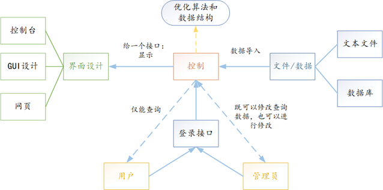

# 三.测试结果

## 3.1五子棋算法

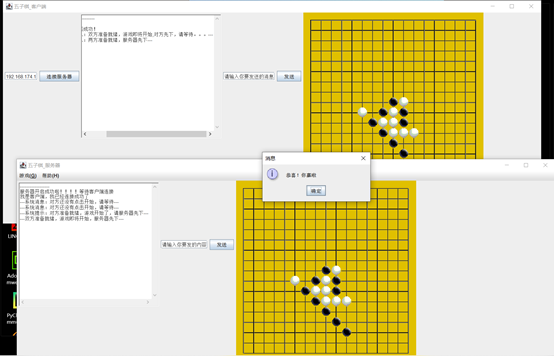

## 3.2联机操作

### 3.2.1联机对战

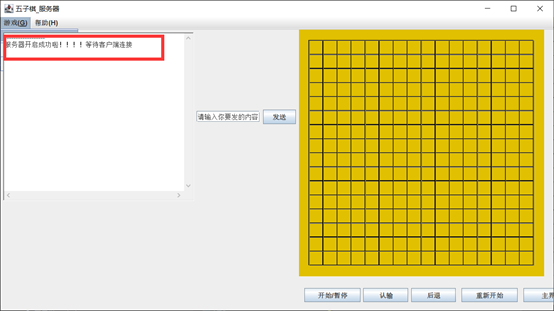

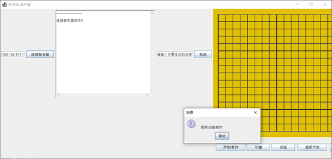

### 3.2.2发送信息

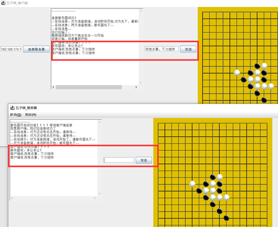

## 3.3存盘与读取

### 3.3.1比赛结束存盘

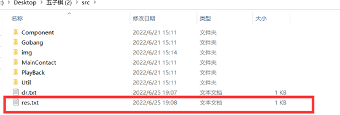

### 3.3.2中途存盘

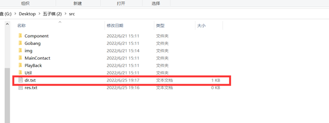

### 3.3.3恢复中途比赛

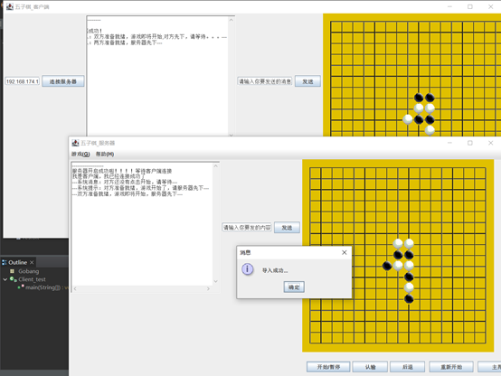

## 3.4回放棋局

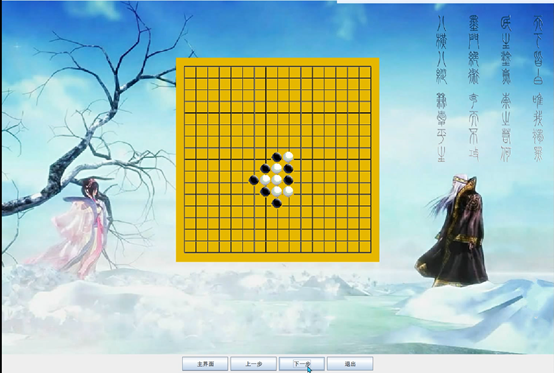

## 3.5图窗界面设置

### 3.5.1主界面

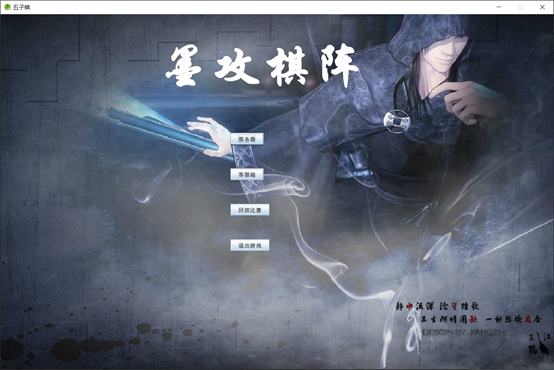

### 3.5.2服务器界面

### 3.5.3客户端界面

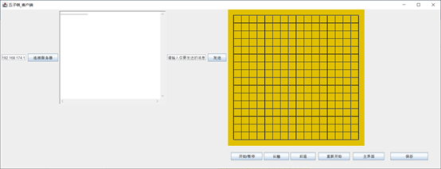

### 3.5.4回放界面

### 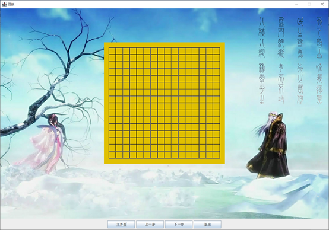

# 四.调试过程

## 4.1五子棋算法调试

给予各个方向的五子连珠情况进行测试，验证五子棋算法的正确性。

## 4.2网络连接调试

通过一台电脑记作服务端和客户端，自己连接自己以及两台电脑在同一个局域网之间进行连接，在连接过程中ip地址和端口号必须一致。

## 4.3多线程运行调试

通过随机组合点击客户端和服务端界面的控制按钮，游戏以期望的结果进行，证明多线程的正确性。

## 4.4文件存储与读取调试

通过在游戏中点击保存以及在游戏开始时点击导入，验证文件存储与导入的一种情况的正确性。另外，通过不同情况下【一方五子连珠，一方认输】游戏结束，自动保存文件，然后在回放界面主动导入进行回放，验证另一种存储与读取的道路正确。

## 4.5界面布局调试

通过选择合适的布局管理器、调节控件的位置和大小，进行适当的布局，使界面正常美观的显示在用户眼前。